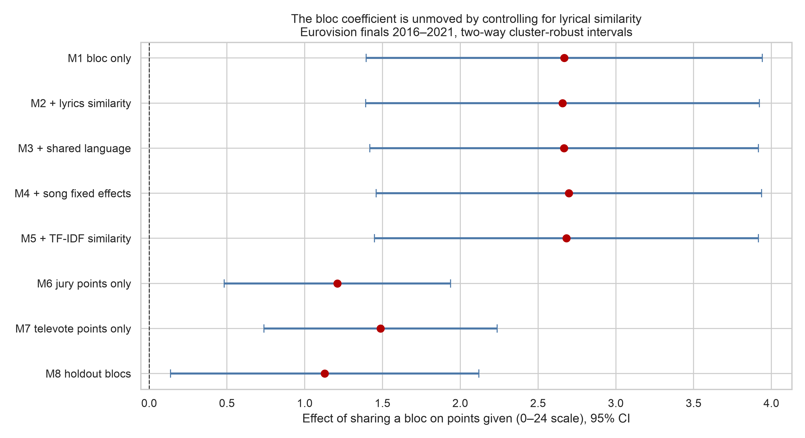
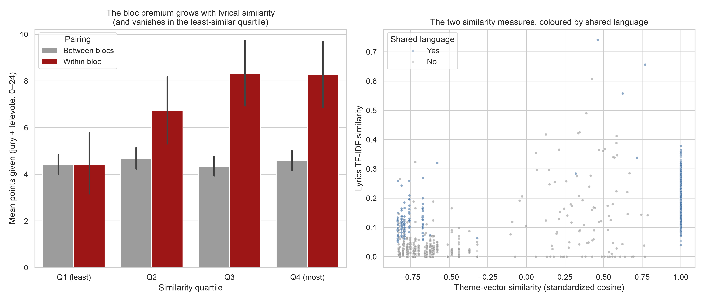

# Causal analysis: does the bloc effect survive controlling for the songs?

**Outcome:** points given in a Eurovision grand final, 2016-2021, jury plus televote on a 0-24 scale. **Unit:** one ordered (voter, recipient, year) dyad, N = 2,883. **Treatment:** `same_bloc`, whether the two countries share a `cluster_id` from the sibling clustering piece.

## Headline

Sharing a bloc is worth **+2.67 points** per dyad-year (mean points to a bloc partner 7.14 against 4.50 to everyone else). Adding the lyrical similarity of the two countries' entries that year changes that to **+2.66** - an attenuation of **0.4%**. Adding shared language, recipient x year fixed effects and a second, independent similarity measure leaves it at **+2.70** (-1.1% from baseline). Controlling for what the songs are actually about explains away essentially **none** of the bloc effect.

The honest qualifier arrives immediately, in the measurement section: the theme scores in `eurovision_enriched2.csv` are substantially degenerate, so this is a weak control, and a weak control cannot explain much away even if the underlying story were true. The design sections below try to compensate with fixed effects that do not depend on that feature at all.

## Building the dyad panel

Votes come through `main.load_data` / `main.clean_data` (which fix the raw file's typos, `sweeden` -> `Sweden`) and the sibling piece's `load_votes`, which additionally harmonizes the voter/recipient spelling split (`United-Kingdom` vs `United Kingdom`). Missing rows are filled as zeros on the reconstructed voter x recipient grid, for the reason set out in the inference report: the file stores only the ten non-zero scores per ballot.

Song metadata comes from `eurovision_enriched2.csv`, which spells countries inconsistently *across years* (`Macedonia` before 2019 and `North Macedonia` after, `Czechia` vs `Czech Republic`, `The Netherlands` vs `Netherlands`). That file is routed through `escxtra_country_mapping.normalize_country`, a different function from the identically named one in `main.py`; using the wrong one on the wrong file silently drops entries rather than erroring, so both are imported under distinct names. Dyads touching a country with no `cluster_id` are dropped, not imputed.

## The lyrics-similarity feature, and what is wrong with it

**Definition used.** Each entry is a 100-dimensional vector of lyric-theme scores. Every theme is standardized *within its own year* and similarity is the cosine between the two entries' standardized vectors, so the measure asks: did these two songs deviate from this year's field in the same thematic directions?

**Alternatives considered.** Raw cosine on the untransformed scores is nearly useless here - the 100 themes are strongly correlated (the first principal component alone carries about half the variance, essentially "how emotionally loaded is this lyric"), so every pair scores above 0.8 and the ranking tracks intensity rather than subject. Euclidean distance inherits that problem and adds scale dependence. Jaccard on top-k themes discards the magnitudes that distinguish a song *about* heartbreak from one that merely mentions it. Standardizing within year removes both each theme's base rate and that year's thematic fashion, which is what the design needs.

**A second, independent measure** is built as a validity check: TF-IDF cosine on the actual lyrics text, computed within year. Its weakness is obvious and its purpose is exactly that - it cannot compare across languages, so where it *disagrees* with the theme measure by language we learn something about the theme measure.

**The data-quality finding.** The theme scores are heavily duplicated. The 248 entries in 2016-2021 carry only 136 distinct theme vectors between them (55%); on average 58% of each year's entries share an identical vector (to six decimal places) with at least one other entry, and the largest such group in a single year covers 9 songs. Songs with entirely different lyrics - all 248 are distinct in the `Lyrics` column - are assigned the same 100 numbers.

| year | n_entries | n_unique_theme_vectors | share_in_duplicate_group | largest_duplicate_group |
| --- | --- | --- | --- | --- |
| 2016 | 42 | 18 | 0.667 | 8 |
| 2017 | 42 | 16 | 0.762 | 9 |
| 2018 | 43 | 30 | 0.395 | 5 |
| 2019 | 41 | 24 | 0.585 | 6 |
| 2020 | 41 | 24 | 0.561 | 7 |
| 2021 | 39 | 24 | 0.513 | 6 |

The validity check confirms what that implies. The two similarity measures correlate at 0.73 across all dyads, but only 0.38 once we restrict to dyads whose entries share a performance language:

| subset | n | corr_theme_vs_tfidf | sd_theme_similarity | sd_tfidf_similarity |
| --- | --- | --- | --- | --- |
| all dyads | 2883 | 0.734 | 0.805 | 0.1 |
| dyads sharing a language | 1757 | 0.38 | 0.566 | 0.064 |
| dyads sharing no language | 1126 | 0.518 | 0.42 | 0.08 |

In other words, a large part of what the theme-vector measure captures is *which language the song is in*, not what the song is about. That is an unfortunate irony for this analysis, since shared language is one of the confounders the control was supposed to help with - so the model includes shared language explicitly rather than leaning on the theme feature to absorb it.

**Consequence for the causal claim.** Classical measurement error in a control attenuates that control's coefficient and leaves part of the confounding in the treatment estimate. So `same_bloc` surviving the addition of `theme_similarity` is *weak* evidence on its own. The specifications below are built so the conclusion does not rest on it.

## Specifications

| model | what it adds |
| --- | --- |
| M1 bloc only | Raw bloc gap, year fixed effects only. |
| M2 + lyrics similarity | Adds the theme-vector similarity of the two countries' entries. |
| M3 + shared language | Adds shared performance language, the most obvious measurable confound. |
| M4 + song fixed effects | Recipient x year fixed effects: compares voters of the same song. |
| M5 + TF-IDF similarity | Adds the independent lyrics-text similarity measure. |
| M6 jury points only | M4 on the jury ballot alone (0-12). |
| M7 televote points only | M4 on the televote ballot alone (0-12). |
| M8 holdout blocs | M4 with blocs re-derived from 2004-2015 votes only. |
| M9 bloc x lyrics similarity | Is the bloc premium larger when the two entries are thematically alike? |
| M10 bloc x TF-IDF similarity | The same interaction using the independent lyrics-text measure. |

Three design choices carry the weight:

1. **Recipient x year fixed effects (M4 onward).** A dummy for every (song, year) means the comparison is *between voters of the same song on the same night*. Song quality, staging, running order, genre, language of the entry, how strong a year that country had - all of it is absorbed by construction, without needing to measure any of it. The residual variation in `same_bloc` is purely which voters happened to be the entrant's bloc partners.
2. **Two-way cluster-robust standard errors** on voter and recipient. Dyadic errors are correlated along both margins; one-way clustering, let alone classical OLS errors, understates them.
3. **MRQAP permutation inference** on the treatment coefficient: bloc labels are re-assigned across countries 2,000 times and the model refit, giving a p-value that never assumes independent dyads at all.

## Results

| model | term | coefficient | std_error | p_value | ci_low | ci_high | r2 |
| --- | --- | --- | --- | --- | --- | --- | --- |
| M1 bloc only | same_bloc | 2.6679 | 0.6496 | 0.00004 | 1.3947 | 3.9411 | 0.0235 |
| M2 + lyrics similarity | same_bloc | 2.6572 | 0.6453 | 0.00004 | 1.3924 | 3.922 | 0.0238 |
| M2 + lyrics similarity | theme_similarity_z | 0.1088 | 0.2183 | 0.61842 | -0.3192 | 0.5367 | 0.0238 |
| M3 + shared language | same_bloc | 2.6674 | 0.6372 | 0.00003 | 1.4186 | 3.9162 | 0.0281 |
| M3 + shared language | theme_similarity_z | 0.5247 | 0.232 | 0.02374 | 0.0699 | 0.9795 | 0.0281 |
| M4 + song fixed effects | same_bloc | 2.6978 | 0.6324 | 0.00002 | 1.4584 | 3.9373 | 0.4441 |
| M4 + song fixed effects | theme_similarity_z | 0.4756 | 0.1936 | 0.01403 | 0.0961 | 0.8551 | 0.4441 |
| M5 + TF-IDF similarity | same_bloc | 2.6819 | 0.6298 | 0.00002 | 1.4475 | 3.9162 | 0.4446 |
| M5 + TF-IDF similarity | theme_similarity_z | 0.3281 | 0.2002 | 0.10131 | -0.0644 | 0.7205 | 0.4446 |
| M6 jury points only | same_bloc | 1.2098 | 0.371 | 0.00111 | 0.4827 | 1.9368 | 0.3159 |
| M6 jury points only | theme_similarity_z | 0.1636 | 0.1347 | 0.22462 | -0.1005 | 0.4277 | 0.3159 |
| M7 televote points only | same_bloc | 1.4881 | 0.3825 | 0.00010 | 0.7384 | 2.2377 | 0.4749 |
| M7 televote points only | theme_similarity_z | 0.312 | 0.0871 | 0.00034 | 0.1412 | 0.4828 | 0.4749 |
| M8 holdout blocs | same_bloc_holdout | 1.1281 | 0.5059 | 0.02576 | 0.1365 | 2.1196 | 0.3885 |
| M8 holdout blocs | theme_similarity_z | 0.3506 | 0.1936 | 0.07018 | -0.0289 | 0.7301 | 0.3885 |
| M9 bloc x lyrics similarity | same_bloc | 2.6139 | 0.5765 | 0.00001 | 1.484 | 3.7439 | 0.4506 |
| M9 bloc x lyrics similarity | theme_similarity_z | 0.3075 | 0.1928 | 0.11076 | -0.0704 | 0.6854 | 0.4506 |
| M9 bloc x lyrics similarity | same_bloc:theme_similarity_z | 1.5263 | 0.3838 | 0.00007 | 0.7741 | 2.2784 | 0.4506 |
| M10 bloc x TF-IDF similarity | same_bloc | 2.5716 | 0.5913 | 0.00001 | 1.4127 | 3.7304 | 0.448 |
| M10 bloc x TF-IDF similarity | same_bloc:tfidf_similarity_z | 1.0487 | 0.3474 | 0.00254 | 0.3678 | 1.7295 | 0.448 |

Full coefficient table including language terms: `voting_blocs_causal_coefficients.csv`.

Two estimator caveats, neither of which touches the coefficient of interest. The outcome is a bounded, zero-inflated count and this is linear OLS, so fitted values are not constrained to 0-24; the fixed-effect design is what buys the interpretation, and the MRQAP p-values do not rely on any distributional assumption. Separately, the multiway cluster-robust estimator returned a negative variance for one nuisance term (`shared_language` in M8) and therefore no standard error for it - a known finite-sample failure of the two-way sandwich with few clusters, not a fitting error.

MRQAP permutation p-values for `same_bloc`: **M1 bloc only: < 0.00050**, **M4 + song fixed effects: < 0.00050**.

*Right panel: the vertical stripe at similarity exactly 1.00 is the duplicated theme vectors - pairs of songs the scoring gave identical values to, spread across the whole range of actual lyric similarity.*

### Reading the table

- **The bloc coefficient does not move.** 2.67 -> 2.66 with lyrical similarity, 2.67 with shared language, 2.70 with song fixed effects. Every interval excludes zero and the permutation p-values sit at the resolution floor.
- **Lyrical similarity does matter, but an order of magnitude less.** A one-SD increase is worth +0.48 points (p = 0.014) against +2.70 for bloc membership - about 6x smaller. Thematic affinity is real and it is not what blocs are made of.
- **Out-of-sample blocs still work.** Re-deriving bloc membership from 2004-2015 votes only - so the treatment cannot be a function of the outcome - gives +1.13 points (p = 0.026). Smaller, as expected when labels are older and noisier, and still clearly positive.
- **Both ballots do it.** Splitting the outcome, the bloc effect is +1.21 points on the jury ballot and +1.49 on the televote (each 0-12). The televote is the bigger of the two, matching the direction found in the inference piece, but the jury effect is large and significant on its own - professional panels favour bloc partners too.

### The bloc premium is not flat in lyrical similarity

The additive models above say lyrical similarity does not *displace* the bloc effect. Interacting the two says something more interesting: the bloc premium **grows** with similarity, by +1.53 points per SD (p = 0.0001), and the same interaction replicates on the independent TF-IDF measure at +1.05 points per SD (p = 0.0025). In the least-similar quartile of dyads the bloc gap is essentially zero; in the top two quartiles it is around four points. Bloc membership and song affinity are **complements, not substitutes**: partners reward each other most when the song is also the kind of song they like.

Two readings survive, and this data cannot separate them. Either bloc voting is conditional loyalty - a partner's song still has to be congenial before the points flow - or, given that the theme measure partly encodes language, the interaction is really "bloc partner singing in a register my audience recognizes". The replication on TF-IDF slightly favours the first reading, since that measure is built from lyric tokens rather than from the degenerate theme scores, but it shares the same language sensitivity, so this is a lead rather than a conclusion.

## Why this is not a randomized controlled trial

**This is an observational design and nothing about it randomizes anything.** In an RCT, treatment would be assigned by the experimenter: we would draw a coin for each ordered pair of countries and, on heads, make them bloc partners. Then `same_bloc` would be independent of every other characteristic of the pair, measured or not, and the difference in points would estimate the causal effect of bloc membership. What we have instead is a treatment that countries acquired through several centuries of geography, migration, empire and broadcasting policy. `same_bloc` is not assigned, it is *selected into* - and worse, it is not even observed directly: it is an estimate produced by clustering the very vote matrix whose entries we are now predicting. The fixed effects remove confounders that live on the song or the voter; they do nothing about confounders that live on the *pair*, and every serious threat here lives on the pair.

**Three concrete unmeasured pair-level confounders.** *Diaspora populations.* Switzerland hosts a large ex-Yugoslav community, Germany a large Turkish-descended one, and Ireland and the UK a substantial mutually resident population. A large resident community from country B in country A raises B's points from A through two channels that have nothing to do with bloc membership as a political construct - people voting for the music they grew up with, and people voting for home. Diaspora size is correlated with bloc membership almost by definition (blocs are largely migration corridors) and correlated with the outcome directly, which is the textbook shape of a confounder. It is not in this dataset in any form. *Broadcast and market overlap.* Countries in the same bloc typically share commercial radio playlists, streaming charts, touring circuits and, in several cases, the same record labels' regional offices. A Swedish song is already familiar to a Norwegian televoter before the contest begins in a way it is not to a Portuguese one, and familiarity drives votes independently of the song's thematic content - which is precisely the part of "musical taste" our lyrics control cannot see, since it is about exposure rather than content. *Shared language and mutual intelligibility.* Serbian, Croatian and Slovenian audiences understand each other's lyrics; Danish, Swedish and Norwegian audiences largely do too. Comprehension changes how a song lands. We measure a crude version of this (`shared_language` from the performance language field) but that field records what language the song was sung in, not whether the two *populations* can understand one another - and since 70% of entries are in English, the variable is close to an English/not-English indicator rather than a mutual-intelligibility measure.

**Two structural problems beyond confounding.** First, **interference between units**: each voter has exactly 58 points to give, so awarding 12 to a bloc partner mechanically removes points available to every other recipient. The stable-unit-treatment-value assumption that underlies the usual causal interpretation of a regression coefficient is violated by the design of the contest itself, and the estimate is better read as a *relative allocation* effect than as an absolute one. Second, **the treatment is estimated from the outcome data**. The bloc labels come from clustering 2004-2021 vote profiles; regressing 2016-2021 points on them re-uses information. The holdout specification (M8) is the answer to this - blocs re-derived from 2004-2015 votes, tested on 2016+ points - and it still returns a clearly positive effect, which is the single most reassuring number in this report. It is not a complete answer: countries' voting relationships are persistent, so old labels still carry information about the same underlying relationships.

**What a better design would look like.** The contest does contain usable quasi-experiments, and naming them is the point of this section. The semi-final draw allocates countries to two semi-finals partly at random within pre-assigned pots, which creates exogenous variation in *which songs a country's public has already seen* before the final - a clean instrument for exposure that is unavailable to the design used here. The 2016 rule change, which split the jury and televote into two separate ballots, is a genuine policy shock and supports a difference-in-differences comparison of bloc effects before and after. Running order is partly producer-assigned and partly drawn, and has a documented effect on scores. Any of these would identify a narrower effect far more credibly than the ~2.7 points estimated here. The estimate in this report should be read as **a well-controlled association, not an experimentally identified causal effect**, and the fixed-effects and holdout specifications are what raise it above a raw correlation - not a claim of identification.

## Verdict for the project's research question

Taste or politics? On this evidence, the bloc effect is **not** musical taste as captured by what the songs are about. Bloc partners exchange roughly 2.7 extra points compared with other voters of *the same song in the same year*, and that figure is essentially untouched by the lyrical similarity of the two entries, by shared performance language, by song fixed effects, and by re-deriving blocs from an earlier, disjoint window. Thematic similarity does buy points - about half a point per standard deviation - but it is a small, separate effect.

The strongest available counter-argument is one this data cannot dismiss: 'musical taste' plausibly means shared *exposure* and shared *sonic convention*, not shared lyrical themes, and none of the controls here observe either. A Nordic voter's affinity for a Swedish pop production is a taste effect that would look identical to a bloc effect in this table. So the defensible conclusion is the narrower one: **the bloc effect is real, robust and large, and it is not explained by what the songs are about.** Whether the residual is politics, diaspora, or a regional sound this dataset never measures is beyond what these controls can separate - and the inference piece's finding that some blocs favour partners through the televote while others do it through the jury suggests all three are present in different places.
