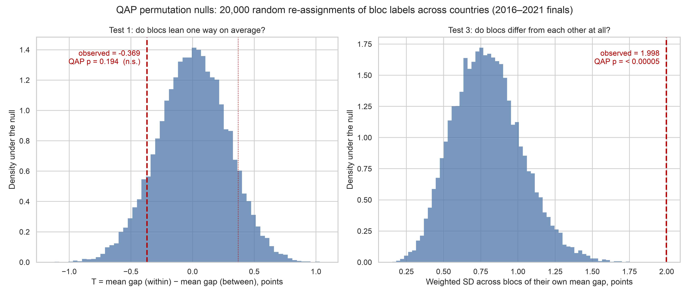
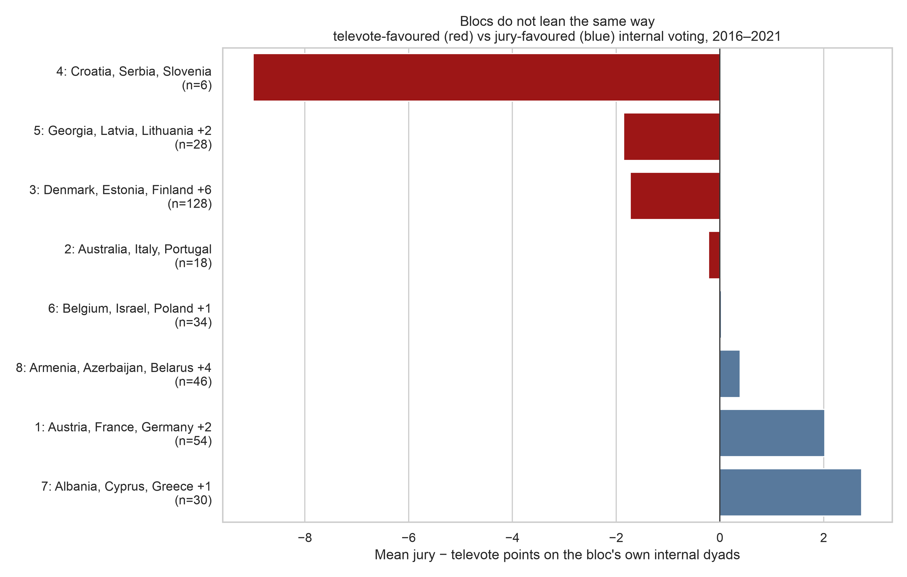
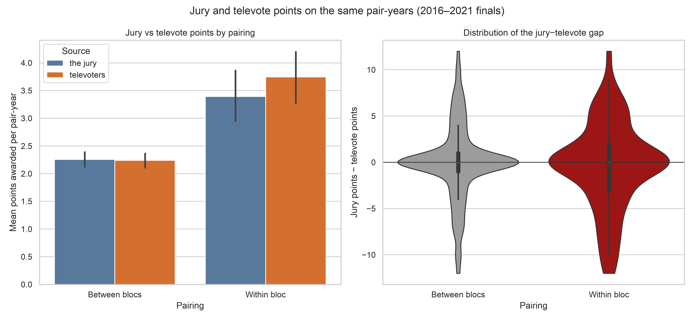

# Statistical inference: does the jury–televote gap depend on bloc membership?

**Window:** 2016–2021 grand finals — every edition in the data carrying a jury/televote split (2020 was cancelled). **Unit of analysis:** one ordered (voter, recipient, year) dyad. **N = 2,883 dyad-years** across 39 clustered countries.

## Summary of findings

| test | question | statistic | QAP p |
| --- | --- | --- | --- |
| 1 (primary) | Do bloc partners get relatively more from the public than from the jury, on average? | T = -0.369 points | 0.194 — **not significant** |
| 2 (secondary) | Same question restricted to top marks (10s and 12s) | T = -0.045 | 0.040 — nominally significant, does not survive correction |
| 3 (heterogeneity) | Do blocs differ *from each other* in how their internal points split? | SD = 1.998 points vs 0.796 expected | **< 0.00005 — significant** |

The headline is the combination of the three. The average bloc is **not** measurably more televote-driven than a random pairing, but blocs are **emphatically not interchangeable with each other**: some award their partners through the public vote and others through the jury, by margins far larger than random re-assignment of the same labels produces. Averaging over blocs cancels these out, which is why test 1 finds nothing and test 3 finds a great deal.

## Hypothesis

Since 2016 every country awards two separate 1–12 ballots: one from a five-member professional jury, one from its public televote. Both rank the same songs on the same night, so their difference is a within-dyad control — everything about the song itself (quality, staging, running order) differences out, and what survives is how *this country's public* rated the entry relative to how *this country's jury* rated it.

For every dyad, `gap = jury points − televote points`. The question is whether its mean differs between dyads whose two countries share a `cluster_id` from the sibling clustering piece (**within-bloc**) and dyads that do not (**between-bloc**).

- **H0:** mean gap(within-bloc) − mean gap(between-bloc) = 0 — bloc partners are no more a televote phenomenon than anyone else.
- **H1 (two-sided):** the difference is non-zero. The substantive prior is one-sided and negative — diaspora and neighbour voting should surface in the public vote, which the jury system exists partly to dampen — but the test is run two-sided.

**Test statistic:** `T = mean(gap | within-bloc) − mean(gap | between-bloc)`, in points.

Two further statistics are reported on the same data, and both are declared here rather than hidden in the results:

- **Secondary outcome:** T computed on `top_gap = 1[jury ≥ 10] − 1[televote ≥ 10]`. About 44% of dyad-years have a gap of exactly zero — nearly all of them 0–0 in both ballots — and only dilute a mean, while the folk accusation against bloc voting is specifically about the automatic 12. A top-mark indicator looks where the effect should be, at the cost of discarding the middle of the scale. **Two outcomes means two tests**, so a Bonferroni threshold of 0.025 applies to each.
- **Heterogeneity test:** the count-weighted standard deviation, across blocs, of each bloc's own mean internal gap. H0 for this one is that the eight blocs are exchangeable groupings; H1 is that they differ from one another. It is one-sided by construction, since a dispersion statistic can only be contradicted from above.

## Data construction

Two decisions determine whether any of these numbers mean anything.

1. **The zeros are reconstructed.** The votes file stores only the ten non-zero scores each ballot hands out, so a pair that scored nothing is an absent row, not missing data. The full voter × recipient grid is rebuilt per year and unrecorded cells filled with 0. Skipping this would condition the analysis on pairs at least one side already liked — a sample censored on the outcome.
2. **Undefined bloc membership is dropped, not guessed.** 3 countries appear in these finals but not in `voting_blocs_clusters.csv` (Czech Republic, North Macedonia, San Marino): they voted in too few editions for the clustering piece to place them. Every dyad touching them has no defined `same_bloc` value and is removed rather than imputed.

One mechanical property bounds what any of this can show: each ballot distributes exactly 58 points, so the gap sums to zero within every voter-year. These statistics are **redistribution** measures. They cannot detect that a bloc is popular, only that a bloc's points arrive through one channel rather than the other.

## Choice of test

The outcome rules out the textbook options for two independent reasons.

**Distribution.** The gap is a difference of two bounded discrete scores from {0,1,…,8,10,12}: spiked at zero (44% of dyad-years), symmetric, heavy-tailed. A t-test's normality assumption does not describe it — though at N ≈ 2,900 the CLT would largely rescue that on its own, so this is the lesser problem.

**Dependence, which is the real problem.** These are dyads, not independent observations. The 25 rows sharing a voter share that country's tastes; the 25 sharing a recipient share that song's appeal; the fixed 58-point budget makes rows within a voter-year mechanically negatively correlated. This is network data, and the documented consequence of ignoring it is not subtle: under realistic row/column autocorrelation, type-I error rates for naive t-statistics on dyadic data have been measured above 50%.

**Primary inference — QAP permutation.** The Mantel/Krackhardt quadratic assignment procedure is the standard permutation scheme when the outcome is a relational matrix. Instead of shuffling rows it shuffles *node labels*: bloc membership is re-assigned at random across the 39 countries and the statistic recomputed, 20,000 times. Because relabelling a country moves its entire row and column together, every replicate preserves the real dependence — generous voters stay generous, popular songs stay popular, budgets still sum to 58, bloc sizes are exactly as observed — and only the hypothesis under test is randomized. The null it builds is precisely *"blocs of this size and shape exist, but they are not **these** countries"*, which is the null the research question needs.

This is also the right *frame*: the 39 countries are not a sample from a population of countries, they are the population. Randomization inference conditional on the observed network is therefore more appropriate here than sampling-based inference.

**Reported for contrast — naive row permutation**, shuffling the within/between label independently across dyad-years. Not the inferential basis; reported to quantify what the dependence costs.

**Interval — pigeonhole (node) bootstrap.** Countries, not dyads, are resampled with replacement 5,000 times and the induced sub-network's statistic recorded. Resampling dyads would understate the width for the same reason row permutation understates the p-value.

**Effect size — Cliff's delta**, `P(gap_within > gap_between) − P(gap_within < gap_between)`. Standardized mean differences such as Cohen's d assume normality and are biased on bounded, ordinal, zero-inflated outcomes; Cliff's delta is purely rank-based and assumes no distribution at all.

## Results

| group | n_pair_years | mean_jury | mean_televote | mean_gap | median_gap | sd_gap | share_nonzero | share_jury_top | share_televote_top |
| --- | --- | --- | --- | --- | --- | --- | --- | --- | --- |
| within_bloc | 344 | 3.392 | 3.744 | -0.352 | 0.0 | 4.782 | 0.677 | 0.137 | 0.177 |
| between_bloc | 2539 | 2.257 | 2.239 | 0.017 | 0.0 | 4.083 | 0.549 | 0.075 | 0.071 |

### Tests 1 and 2 — direction

| quantity | primary (`gap`, points) | secondary (`top_gap`, share) |
| --- | --- | --- |
| mean, within-bloc dyads | -0.352 | -0.040 |
| mean, between-bloc dyads | 0.017 | +0.004 |
| **observed T** | **-0.369** | **-0.045** |
| QAP null SD | 0.284 | 0.022 |
| QAP z (T / null SD) | -1.30 | -2.04 |
| **QAP p-value** (20,000 relabellings) | **0.1945** | **0.0402** |
| 95% node-bootstrap CI | [-1.804, 1.100] | [-0.155, 0.057] |

Naive row-permutation p on the primary outcome: **0.1304** (against 0.1945 from QAP). Cliff's delta: **-0.025**.

### Test 3 — heterogeneity across blocs

| quantity | all blocs | blocs with ≥ 20 dyad-years |
| --- | --- | --- |
| observed weighted SD of bloc mean gaps | **1.998** | **1.693** |
| mean under the QAP null | 0.796 | 0.682 |
| **QAP p-value (one-sided)** | **< 0.00005** | **0.0002** |

*Left: the primary statistic sits well inside its null. Right: the heterogeneity statistic sits far outside its own.*

### Descriptive breakdowns

The per-year table below is descriptive only — five uncorrected comparisons on small samples.

| year | n_within | n_between | mean_gap_within | mean_gap_between | T |
| --- | --- | --- | --- | --- | --- |
| 2016 | 62 | 538 | -0.145 | -0.03 | -0.115 |
| 2017 | 79 | 546 | 0.253 | -0.037 | 0.29 |
| 2018 | 84 | 516 | -0.56 | 0.302 | -0.862 |
| 2019 | 62 | 444 | -1.468 | -0.126 | -1.342 |
| 2021 | 57 | 495 | 0.105 | -0.04 | 0.146 |

| cluster_id | n_dyad_years | mean_jury | mean_televote | mean_gap |
| --- | --- | --- | --- | --- |
| 4 | 6 | 0.33 | 9.33 | -9.0 |
| 5 | 28 | 4.32 | 6.18 | -1.857 |
| 3 | 128 | 2.28 | 4.01 | -1.727 |
| 2 | 18 | 2.33 | 2.56 | -0.222 |
| 6 | 34 | 1.94 | 1.91 | 0.029 |
| 8 | 46 | 4.24 | 3.85 | 0.391 |
| 1 | 54 | 4.72 | 2.7 | 2.019 |
| 7 | 30 | 6.47 | 3.73 | 2.733 |

(Bloc membership lists are in `voting_blocs_inference_by_bloc.csv`.)

## Interpretation

**Test 1 fails to reject, and the estimate is in the predicted direction.** Within-bloc dyads are televote-favoured by 0.37 points per dyad-year: a bloc partner's public gives 3.74 points where its jury gives 3.39, while for non-partners the two ballots agree almost exactly (2.24 vs 2.26). But the QAP null has SD 0.284, the observed T is only 1.3 SDs out, 19% of random re-assignments of the same labels to different countries are at least this extreme, and the bootstrap interval [-1.804, 1.100] contains zero. **H0 is not rejected.**

**The design's resolution, stated explicitly.** Only 344 of 2,883 dyad-years are within-bloc — eight blocs across 39 countries makes roughly one dyad in eight a partner pairing — and the gap has SD ≈ 4.8 points. Against the QAP null, the smallest effect this design could detect at 80% power is |T| ≈ 0.80 points, about 2.2× the effect observed. The correct reading is *inconclusive*, not *absent*. Five contests is not many, and it is the number of **countries**, not the number of dyad-years, that sets the resolution.

**Test 2 agrees in direction and is nominally significant, and should still not be sold as a finding.** Within-bloc dyads are 4.5 percentage points more likely to draw a top mark from the public than from the jury, relative to between-bloc dyads (p = 0.040). That clears 0.05 but not the Bonferroni threshold of 0.025 for two outcomes, and its node-bootstrap interval [-0.155, 0.057] includes zero. Suggestive, not conclusive. The disagreement between permutation and bootstrap is itself informative: the permutation test conditions on the observed network and asks only whether *these* labels are special, while the bootstrap asks what would happen with a different draw of countries — a question this design answers poorly, since resampling 39 nodes routinely deletes an entire small bloc.

**Test 3 rejects decisively, and it is the real result.** The spread of bloc mean gaps is 2.00 points against 0.80 expected under random relabelling (p < 0.00005), and the result survives dropping the small blocs (1.69 vs 0.68, p = 0.0002), so it is not an artefact of one thin cell. Concretely: 4 blocs reward their partners through the televote and 4 through the jury. The ex-Yugoslav trio (Croatia, Serbia, Slovenia) is the extreme case — juries averaging 0.33 points to each other against 9.33 from the publics — with the post-Soviet and Nordic groups leaning the same way, while the Western European core (Austria, France, Germany, Netherlands, Switzerland) and the eastern Mediterranean group (Albania, Cyprus, Greece, Malta) lean the other way, their juries backing partners *more* than their publics do. Pooling these into one average is what produced the null in test 1.

**What this supports.** A single 'bloc effect' with one sign does not exist in this data; two distinguishable mechanisms do. Where partner points arrive through the televote and not the jury, the diaspora / cross-border-broadcast / familiarity reading is the natural one — those are exactly the channels that move a public and not a panel of music professionals. Where partner points arrive through the *jury*, that reading is unavailable, and shared musical convention, shared language, or the small-panel idiosyncrasy of five people is more plausible. The project's framing question — taste or politics — is therefore mis-posed as an either/or: the answer is bloc-specific, and this test says so with p < 0.001.

**Caveat on the labels themselves.** `cluster_id` comes from the sibling piece's clustering of *centered outgoing vote profiles*, which groups countries that vote **alike** — not countries that vote **for each other**. Cluster 2 (Australia, Italy, Portugal) is explicitly a group of contest outsiders with no mutual-affinity story, and the sibling report flags Belgium/Israel/Poland/Spain as a residual rather than a bloc. Those dyads carry no hypothesized effect and attenuate test 1 by construction. A mutual-points definition of 'bloc' would be a different, and probably better-powered, test of the same idea.

**On the two nulls.** Row permutation gives p = 0.1304, QAP gives p = 0.1945. Both land the same side of any conventional threshold here, so the conclusion is unchanged — but the naive null credits this analysis with 2,883 independent observations when the design contains 39 exchangeable units, and with an effect nearer the boundary that difference would have decided the result.

**Handover to the causal piece.** This test isolates *which ballot* carries bloc points; it says nothing about whether bloc membership predicts points at all once the songs themselves are accounted for. That is the question `voting_blocs_causal_report.md` takes up, controlling for the lyrical similarity of the two countries' entries.
